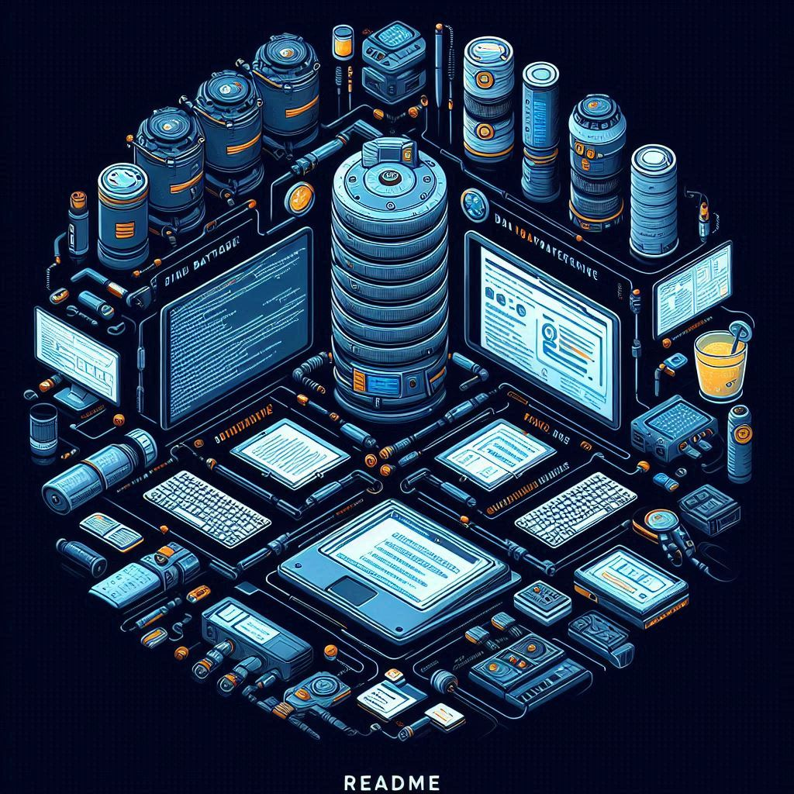

# 📊 Projeto Final BD1 - Game Dashboard

Um dashboard para visualização de dados de jogos, desenvolvido com tecnologias de front-end e back-end.

  

## 📚 Tabela de Conteúdos

- [📊 Projeto Final BD1 - Game Dashboard](#-projeto-final-bd1---game-dashboard)
  - [📚 Tabela de Conteúdos](#-tabela-de-conteúdos)
  - [📋 Descrição](#-descrição)
    - [🚀 Funcionalidades](#-funcionalidades)
      - [📈 Gráficos](#-gráficos)
      - [📊 Tabelas](#-tabelas)
    - [🌐 Acesso](#-acesso)
  - [⚙️ Construção](#️-construção)
    - [💻 Tecnologias](#-tecnologias)
    - [🛠️ Ferramentas](#️-ferramentas)
    - [📌 Versão](#-versão)
  - [✏️ Aprendizado](#️-aprendizado)
  - [✒️ Autores](#️-autores)
  - [🎁 Agradecimentos](#-agradecimentos)
  - [📨 Contato](#-contato)

## 📋 Descrição

Este é um projeto de um dashboard para visualização de dados de jogos. O projeto foi desenvolvido para a disciplina de Banco de Dados 1 e tem como objetivo reunir gráficos e tabelas contendo as informações de todas as consultas realizadas.

### 🚀 Funcionalidades

As funcionalidades disponíveis para os usuários estão listadas abaixo:

#### 📈 Gráficos

Todos os gráficos do sistema foram feitos com o auxílio da biblioteca ‘react-chartjs-2’, que permite uma integração entre a biblioteca Chart.js (popular para criar gráficos interativos e visualizações de dados) e a biblioteca React. Funcionalidades adicionais incluem:

- Legendas interativas: o usuário pode clicar nos itens da legenda para mostrar ou esconder conjuntos de dados.
- Tooltips interativos: fornecem informações detalhadas ao passar o cursor sobre os elementos do gráfico, aumentando a interatividade e melhorando a visualização dos dados.

#### 📊 Tabelas

Todas as tabelas do sistema foram feitas com o auxílio da biblioteca React, juntamente com as bibliotecas “styled-components” (para estilizar componentes diretamente dentro dos arquivos JavaScript) e “react-bootstrap/Table” (para estilização e funcionalidade de tabelas baseadas em Bootstrap). Funcionalidades adicionais incluem:

- Definição de estilos padrões para as tabelas.
- Implementação de um sistema de paginação (máximo de 50 linhas por página).
- Barra de pesquisa para filtrar os dados das tabelas.

### 🌐 Acesso

🖇️ [Clique aqui para acessar o repositório do projeto no GitHub](https://github.com/milton-salgado/projeto-final-bd1-game-dashboard)

## ⚙️ Construção

Resumo geral dos recursos utilizados na construção do projeto.

### 💻 Tecnologias

Tecnologias utilizadas na construção do projeto:

### 🛠️ Ferramentas

Ferramentas utilizadas na construção do projeto:

### 📌 Versão

Utilizamos o Git para o controle de versão. 

Versão atual: 1.0 (primeira versão)

## ✏️ Aprendizado

Ao fazer esse projeto, aprendemos a:

- Desenvolver um projeto full stack utilizando tecnologias de back-end (Python, FastAPI, SQLAlchemy, Uvicorn) e front-end (React JS, HTML, CSS, JavaScript).
- Integrar e utilizar bibliotecas de visualização de dados, como Chart.js e React-ChartJS-2.
- Implementar sistemas interativos e responsivos com React.
- Realizar consultas eficientes ao banco de dados com MySQL e SQLAlchemy.
- Utilizar ferramentas de versionamento e colaboração de código (Git e GitHub).

## ✒️ Autores

* **Eduardo Gabriel Teixeira Barros**
* **Luíz Eduardo Azevedo Brasil**
* **Milton Salgado Leandro**
* **Nícolas da Mota Arruda**
* **Pedro Henrique Honorio Saito**

## 🎁 Agradecimentos

* Agradecemos aos professores e colegas pela orientação e apoio durante a realização deste projeto.
* Agradecemos também a você, visitante, por visualizar o nosso projeto!

## 📨 Contato

